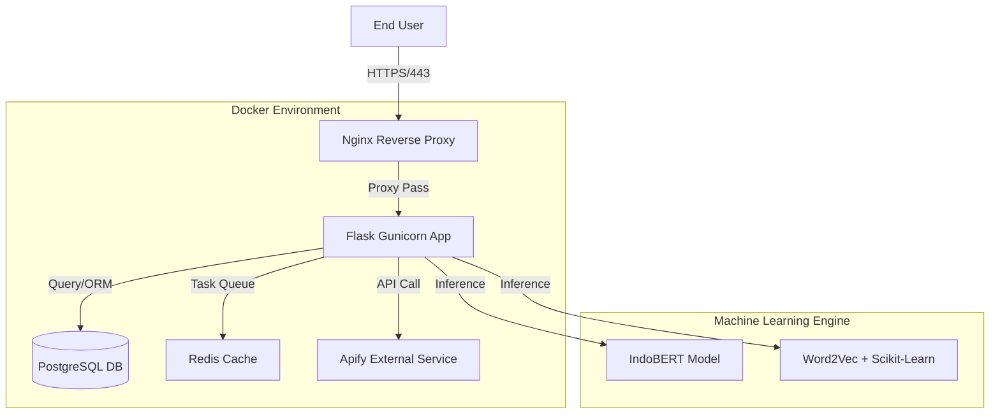
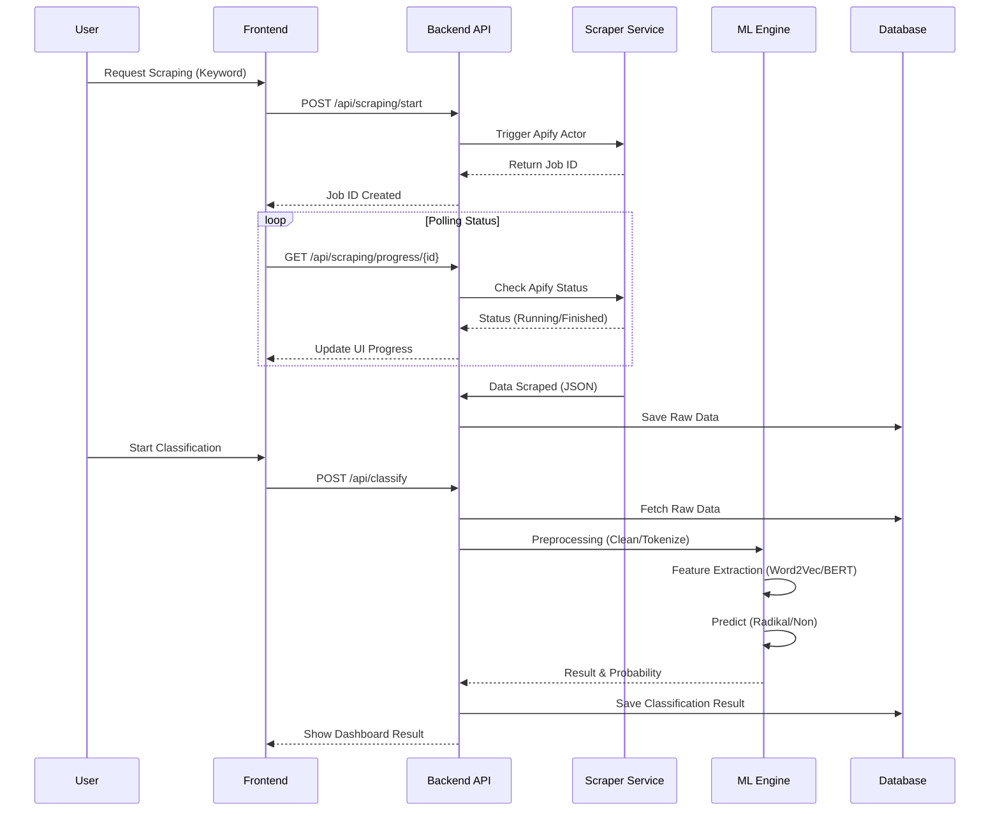

# 📘 SPESIFIKASI SISTEM APLIKASI WASKITA

**Versi Dokumen:** 2.0  
**Tanggal Pembaruan:** 19 Desember 2025

Dokumen ini merinci spesifikasi teknis, arsitektur, dan kebutuhan sistem untuk aplikasi Waskita (Analisis Konten Radikal).

---

## 📋 DAFTAR ISI
1. [Arsitektur Sistem](#1-arsitektur-sistem)
2. [Spesifikasi Teknis](#2-spesifikasi-teknis)
3. [Alur Data (Data Flow)](#3-alur-data-data-flow)
4. [Instalasi & Konfigurasi](#4-instalasi--konfigurasi)
5. [Dokumentasi API](#5-dokumentasi-api)
6. [Error Handling](#6-error-handling)

---

## 1. Arsitektur Sistem

Waskita menggunakan arsitektur **Monolithic** yang dimodernisasi dengan pemisahan komponen melalui **Docker Containers**.

### Diagram Arsitektur (High-Level)


### Komponen Utama
1.  **Web Server (Nginx):** Menangani koneksi SSL, melayani file statis, dan load balancing request ke aplikasi.
2.  **Application Server (Gunicorn + Flask):** Menjalankan logika bisnis, autentikasi, dan pemrosesan ML.
3.  **Database (PostgreSQL):** Menyimpan data user, dataset, hasil scraping, dan hasil klasifikasi.
4.  **ML Engine:** Modul terintegrasi di dalam aplikasi Flask untuk memuat model (IndoBERT/Word2Vec) ke memori.

---

## 2. Spesifikasi Teknis

### Technology Stack
| Komponen | Teknologi | Versi | Deskripsi |
| :--- | :--- | :--- | :--- |
| **Backend** | Python Flask | 2.3.3 | Framework web utama. |
| **Database** | PostgreSQL | 14+ | RDBMS transactional. |
| **ORM** | SQLAlchemy | 3.0.5 | Abstraksi database. |
| **ML Libraries** | Scikit-learn | 1.3.0 | Algoritma klasifikasi konvensional. |
| **NLP** | Gensim | 4.3.2 | Word embedding (Word2Vec). |
| **Transformers** | HuggingFace | 4.30.0 | Model IndoBERT. |
| **Container** | Docker | 24.0+ | Runtime lingkungan isolasi. |

### Dependensi Kunci
*   `psycopg2-binary`: Driver database PostgreSQL.
*   `Flask-Login`: Manajemen sesi user.
*   `Flask-WTF`: Form handling dan proteksi CSRF.
*   `gunicorn`: WSGI HTTP Server.

---

## 3. Alur Data (Data Flow)

Berikut adalah diagram alur data utama mulai dari input user hingga hasil klasifikasi.



---

## 4. Instalasi & Konfigurasi

Panduan ringkas untuk setup lingkungan produksi.

### Prasyarat
*   OS: Linux Ubuntu 20.04/22.04 LTS
*   RAM: Min 8GB (karena model ML berat)
*   Docker & Docker Compose terinstall

### Langkah Instalasi
1.  **Clone Repository:**
    ```bash
    git clone https://github.com/Sandiman184/waskita-app.git
    cd waskita-app
    ```

2.  **Konfigurasi Environment:**
    ```bash
    cp .env.example.docker .env
    nano .env
    # Isi SECRET_KEY, DATABASE_URL, MAIL_PASSWORD, dll.
    ```

3.  **Build & Run:**
    ```bash
    docker compose -f docker/docker-compose.prod.yml up -d --build
    ```

4.  **Inisialisasi Database:**
    ```bash
    docker compose -f docker/docker-compose.prod.yml run --rm backend flask db upgrade
    docker compose -f docker/docker-compose.prod.yml run --rm backend python src/backend/create_admin.py
    ```

---

## 5. Dokumentasi API

Berikut adalah dokumentasi endpoint utama yang digunakan oleh frontend.

### A. Health Check
Memeriksa status server dan ketersediaan model ML.
*   **Endpoint:** `GET /api/health`
*   **Response (200 OK):**
    ```json
    {
      "status": "healthy"
    }
    ```

### B. Scraping Progress
Melihat status proses scraping data.
*   **Endpoint:** `GET /api/scraping/progress/<job_id>`
*   **Headers:** `Authorization: Bearer <token>` (jika pakai JWT) atau Session Cookie.
*   **Response (200 OK):**
    ```json
    {
      "success": true,
      "data": {
        "status": "RUNNING",
        "progress_percentage": 45,
        "items_processed": 150,
        "requests_handled": 160
      }
    }
    ```

### C. Klasifikasi Data
Melakukan klasifikasi pada teks input.
*   **Endpoint:** `POST /api/classify/text`
*   **Body:**
    ```json
    {
      "text": "Konten yang ingin dianalisis...",
      "model": "indobert"
    }
    ```
*   **Response (200 OK):**
    ```json
    {
      "label": "non-radikal",
      "probability": {
        "radikal": 0.15,
        "non-radikal": 0.85
      },
      "processing_time": 0.45
    }
    ```

---

## 6. Error Handling

Aplikasi menggunakan kode status HTTP standar untuk komunikasi error.

| Kode Status | Keterangan | Penyebab Umum |
| :--- | :--- | :--- |
| **200 OK** | Sukses | Request berhasil diproses. |
| **400 Bad Request** | Format Salah | Input JSON tidak valid atau parameter kurang. |
| **401 Unauthorized** | Tidak Login | Sesi habis atau belum login. |
| **403 Forbidden** | Akses Ditolak | User biasa mencoba mengakses fitur Admin. |
| **404 Not Found** | Tidak Ditemukan | Endpoint atau ID data tidak ada di database. |
| **500 Server Error** | Masalah Server | Crash pada model ML atau koneksi DB terputus. |

### Format Response Error
```json
{
  "success": false,
  "message": "Deskripsi error yang user-friendly",
  "error_code": "DB_CONNECTION_ERROR"
}
```
