# 📘 Spesifikasi Sistem Aplikasi Waskita

Versi Dokumen: 1.3 — Diperbarui: 2025-01-15

## 1. Persyaratan Fungsional (Functional Requirement)

- Requirement: FR-001 Login User
  - Deskripsi: Sistem menyediakan halaman login dengan verifikasi email/username dan password yang di-hash. Jika berhasil, pengguna diarahkan ke Dashboard sesuai perannya.
  - Actor: User, Admin
  - Action: Mengirim kredensial, menerima sesi dengan cookie HttpOnly Secure.

- Requirement: FR-002 Registrasi User
  - Deskripsi: Pengguna dapat membuat akun melalui form pendaftaran (username, email, password). Validasi unik email/username dan penyimpanan password hash.
  - Actor: User
  - Action: Submit form registrasi, konfirmasi pendaftaran.

- Requirement: FR-003 Manajemen Peran (Role Management)
  - Deskripsi: Sistem mendukung peran Admin dan User. Admin memiliki akses CRUD penuh terhadap data dan pengguna. User hanya mengakses data milik sendiri.
  - Actor: Admin, Sistem
  - Action: Admin menetapkan peran; sistem melakukan kontrol akses berbasis peran.

- Requirement: FR-004 Dashboard Berbasis Peran
  - Deskripsi: Setelah login, pengguna diarahkan ke dashboard sesuai peran dengan ringkasan dataset, status cleaning, dan klasifikasi.
  - Actor: User, Admin
  - Action: Redirect pasca login, menampilkan informasi ringkas dan tindakan cepat.

- Requirement: FR-005 Upload Dataset
  - Deskripsi: Pengguna mengunggah dataset dalam format CSV/XLSX. Sistem memvalidasi file, memetakan kolom, dan menyimpan metadata.
  - Actor: User, Sistem
  - Action: Unggah file, tampilkan hasil validasi dan mapping kolom.

- Requirement: FR-006 Scraping Data Sosial
  - Deskripsi: Pengguna men-setup scraping dari platform (Twitter, Facebook, Instagram, TikTok) dengan parameter kata kunci dan rentang tanggal.
  - Actor: User, Sistem
  - Action: Konfigurasi scraping, menjalankan proses, menyimpan hasil.

- Requirement: FR-007 Cleaning Data
  - Deskripsi: Sistem membersihkan data yang di-upload atau di-scrape (hapus emoji, link, tanda baca), normalisasi teks, dan menyimpan hasil untuk klasifikasi.
  - Actor: Sistem
  - Action: Menjalankan job cleaning, mencatat status dan hasil.

- Requirement: FR-008 Klasifikasi Data
  - Deskripsi: Sistem mengklasifikasikan data yang telah dibersihkan menggunakan model Naive Bayes pra-latih dan embeddings Word2Vec, menampilkan label (Radikal/Non‑Radikal) dan probabilitas.
  - Actor: User, Sistem
  - Action: Menjalankan klasifikasi dan menampilkan hasil.

- Requirement: FR-009 Detail Hasil Klasifikasi
  - Deskripsi: Menampilkan detail setiap item (teks asli, teks bersih, label, probabilitas, waktu klasifikasi, model versi).
  - Actor: User, Admin
  - Action: Navigasi ke detail, ekspor hasil.

- Requirement: FR-010 Notifikasi Tindakan
  - Deskripsi: Sistem menampilkan notifikasi (SweetAlert2) untuk upload sukses, cleaning selesai, klasifikasi selesai, dan peringatan jika klasifikasi dilakukan sebelum cleaning.
  - Actor: Sistem
  - Action: Menampilkan notifikasi kontekstual di UI.

- Requirement: FR-011 Pengaturan Bahasa & Tema
  - Deskripsi: Bahasa default Indonesia; pengguna dapat memilih bahasa lain. Tema mendukung Dark/Light mode dengan default Dark. Profil menampilkan Recent Activities dalam bentuk timeline vertikal yang responsif.
  - Actor: User
  - Action: Mengubah preferensi bahasa/tema di profil, melihat riwayat aktivitas.

- Requirement: FR-012 Audit Log
  - Deskripsi: Semua aksi penting dicatat (login, upload, scraping, cleaning, klasifikasi, perubahan oleh admin) untuk audit.
  - Actor: Sistem, Admin
  - Action: Merekam event dan menampilkan laporan audit.

- Requirement: FR-013 Manajemen Pengguna oleh Admin
  - Deskripsi: Admin dapat membuat, mengubah, menghapus pengguna; reset password; mengatur peran.
  - Actor: Admin
  - Action: Operasi CRUD pengguna.

- Requirement: FR-014 Manajemen Dataset oleh Admin
  - Deskripsi: Admin mengelola seluruh dataset (lihat, edit metadata, hapus, ekspor).
  - Actor: Admin
  - Action: Operasi CRUD dataset.

- Requirement: FR-015 Manajemen Klasifikasi oleh Admin
  - Deskripsi: Admin mengelola hasil klasifikasi (review, re‑run, hapus, ekspor laporan).
  - Actor: Admin
  - Action: Operasi pada hasil klasifikasi.

- Requirement: FR-016 Keamanan Login
  - Deskripsi: Password selalu disimpan sebagai hash (bcrypt); sesi menggunakan cookie HttpOnly Secure; CSRF aktif.
  - Actor: Sistem
  - Action: Validasi autentikasi dan set cookie aman.

- Requirement: FR-017 Rate Limiting & Proteksi Scanner
  - Deskripsi: Rate limiting aktif dan kompatibel dengan OWASP ZAP (user‑agent scanner dikecualikan dari limit dan pemeriksaan pola).
  - Actor: Sistem
  - Action: Menerapkan batas request per menit/jam dan pengecualian scanner.

- Requirement: FR-018 Integrasi API Internal
  - Deskripsi: API kesehatan (`/api/health`) dan status model (`/api/models-status`) tersedia untuk monitoring.
  - Actor: Sistem, Admin
  - Action: Memanggil endpoint untuk verifikasi sistem.

## 2. Persyaratan Metode (Method Requirement)

- Requirement: MR-001 Autentikasi (Session-Based)
  - Purpose: Menjamin akses aman berbasis sesi untuk aplikasi web.
  - Method/Tool Used: Flask‑Login (session), cookie HttpOnly Secure, redirect berbasis peran.

- Requirement: MR-002 Hash Password
  - Purpose: Melindungi kredensial pengguna dari kebocoran.
  - Method/Tool Used: Bcrypt untuk hashing password.

- Requirement: MR-003 Rate Limiting
  - Purpose: Mencegah penyalahgunaan API dan serangan DoS ringan.
  - Method/Tool Used: Flask‑Limiter, pengecualian untuk user‑agent OWASP ZAP di middleware.

- Requirement: MR-004 CSRF Protection
  - Purpose: Mencegah serangan CSRF pada form.
  - Method/Tool Used: Flask‑WTF CSRF.

- Requirement: MR-005 Localization
  - Purpose: Mendukung bahasa default Indonesia dan opsi bahasa lain.
  - Method/Tool Used: Flask‑Babel (konfigurasi default `id`).

- Requirement: MR-006 Upload & Validasi Dataset
  - Purpose: Memastikan data masuk sesuai format yang dibutuhkan.
  - Method/Tool Used: Validasi header kolom, parsing CSV/XLSX, penyimpanan metadata.

- Requirement: MR-007 Scraping Media Sosial
  - Purpose: Mengumpulkan data dari platform sosial berdasarkan parameter.
  - Method/Tool Used: Integrasi layanan scraping (mis. Apify) dan penyimpanan hasil.

- Requirement: MR-008 Cleaning Data
  - Purpose: Menyiapkan teks untuk klasifikasi dengan pembersihan karakter tidak diinginkan.
  - Method/Tool Used: Normalisasi, penghapusan emoji, URL, tanda baca, lowercasing.

- Requirement: MR-009 Klasifikasi ML
  - Purpose: Mengklasifikasikan konten menjadi Radikal/Non‑Radikal.
  - Method/Tool Used: Embeddings Word2Vec dan model Naive Bayes pra‑latih (file `.pkl`).

- Requirement: MR-010 Notifikasi UI
  - Purpose: Memberikan umpan balik instan kepada pengguna.
  - Method/Tool Used: SweetAlert2.

- Requirement: MR-011 Logging & Audit
  - Purpose: Menjaga jejak aktivitas untuk kepatuhan dan forensik.
  - Method/Tool Used: `security_logger` dengan audit log terstruktur (disimpan di absolute path `logs/`).

- Requirement: MR-012 Deployment & Reverse Proxy
  - Purpose: Menyajikan aplikasi secara aman di produksi.
  - Method/Tool Used: Docker Compose, Nginx (SSL), Gunicorn.

- Requirement: MR-013 SSL/TLS
  - Purpose: Menyediakan koneksi aman HTTPS.
  - Method/Tool Used: Let’s Encrypt (Certbot), HSTS.

- Requirement: MR-014 CORS
  - Purpose: Mengontrol akses lintas domain pada API bila diperlukan.
  - Method/Tool Used: Middleware CORS.

- Requirement: MR-015 Role-Based Access Control (RBAC)
  - Purpose: Membatasi akses fitur berdasarkan peran.
  - Method/Tool Used: Dekorator/guard peran di route.

## 3. Sequence Diagram (Mermaid)

### 3a. Sequence Diagram — End-to-End & Logging Keamanan

## 4. Sistem Arsitektur (Mermaid)

```mermaid
flowchart TD
    U[User] -->|HTTPS| NX[Nginx]
    CDN[CDN Libraries] --> NX
    NX --> WEB[Flask + Gunicorn]
    WEB --> DB[(PostgreSQL)]
    WEB --> REDIS[(Redis)]
    WEB --> MODELS[(Word2Vec & Naive Bayes Models)]
    NX --> CERTS[(Let’s Encrypt SSL Certs)]
    subgraph Monitoring
        LOGS[Audit & Security Logs]
    end
    WEB --> LOGS
```

## 5. Activity Diagram (Mermaid)

### Registrasi User

### Dashboard User

### Manajemen Data Source (Scraping)

### Manajemen Dataset

### Proses Cleaning

### Proses Klasifikasi

### Hasil Klasifikasi

### Admin Panel

### 5a. Flowchart — End-to-End Aplikasi

## 6. Database Structure (Mermaid ERD)

## 7. Detail Database Structure

- Tabel: users
  - Kolom: 
    - id SERIAL PK
    - email VARCHAR(255) UNIQUE NOT NULL
    - username VARCHAR(50) UNIQUE NOT NULL
    - password_hash VARCHAR(255) NOT NULL
    - is_active BOOLEAN DEFAULT TRUE
    - last_login TIMESTAMP NULL
    - language VARCHAR(5) DEFAULT 'id'
    - timezone VARCHAR(50) DEFAULT 'Asia/Jakarta'
    - created_at TIMESTAMP DEFAULT NOW()
    - updated_at TIMESTAMP DEFAULT NOW()
  - Primary key: id
  - Constraints: email/username unik, password wajib, default bahasa Indonesia.
  - Deskripsi: Menyimpan data pengguna aplikasi.

- Tabel: roles
  - Kolom:
    - id SERIAL PK
    - name VARCHAR(50) UNIQUE NOT NULL
    - description TEXT NULL
  - Primary key: id
  - Constraints: name unik.
  - Deskripsi: Menyimpan definisi peran (Admin, User).

- Tabel: user_roles
  - Kolom:
    - user_id INT FK -> users(id)
    - role_id INT FK -> roles(id)
    - assigned_at TIMESTAMP DEFAULT NOW()
  - Primary key: (user_id, role_id)
  - Constraints: FK valid ke users/roles.
  - Deskripsi: Relasi many‑to‑many antara pengguna dan peran.

- Tabel: data_sources
  - Kolom:
    - id SERIAL PK
    - platform VARCHAR(50) NOT NULL
    - keywords TEXT NOT NULL
    - date_from DATE NULL
    - date_to DATE NULL
    - status VARCHAR(20) DEFAULT 'pending'
    - created_by INT FK -> users(id)
    - created_at TIMESTAMP DEFAULT NOW()
  - Primary key: id
  - Constraints: created_by valid, platform terdefinisi.
  - Deskripsi: Konfigurasi sumber data scraping.

- Tabel: datasets
  - Kolom:
    - id SERIAL PK
    - name VARCHAR(100) NOT NULL
    - description TEXT NULL
    - source_type VARCHAR(20) NOT NULL CHECK (source_type IN ('upload','scrape'))
    - data_source_id INT FK -> data_sources(id) NULL
    - file_path TEXT NULL
    - records_count INT DEFAULT 0
    - created_by INT FK -> users(id)
    - created_at TIMESTAMP DEFAULT NOW()
  - Primary key: id
  - Constraints: FKs valid, source_type valid.
  - Deskripsi: Metadata dataset yang diupload atau hasil scraping.

- Tabel: records
  - Kolom:
    - id SERIAL PK
    - dataset_id INT FK -> datasets(id)
    - external_id VARCHAR(100) NULL
    - content TEXT NOT NULL
    - author VARCHAR(100) NULL
    - posted_at TIMESTAMP NULL
    - raw_json JSONB NULL
    - cleaned_text TEXT NULL
    - contains_media BOOLEAN DEFAULT FALSE
    - created_at TIMESTAMP DEFAULT NOW()
  - Primary key: id
  - Constraints: dataset_id valid; content wajib.
  - Deskripsi: Rekaman teks dari dataset (upload/scrape).

- Tabel: cleaning_jobs
  - Kolom:
    - id SERIAL PK
    - record_id INT FK -> records(id)
    - status VARCHAR(20) DEFAULT 'completed'
    - removed_emojis BOOLEAN DEFAULT TRUE
    - removed_urls BOOLEAN DEFAULT TRUE
    - removed_punct BOOLEAN DEFAULT TRUE
    - errors TEXT NULL
    - cleaned_at TIMESTAMP DEFAULT NOW()
  - Primary key: id
  - Constraints: record_id valid.
  - Deskripsi: Catatan pembersihan untuk setiap record.

- Tabel: classification_results
  - Kolom:
    - id SERIAL PK
    - record_id INT FK -> records(id)
    - label VARCHAR(20) NOT NULL CHECK (label IN ('Radikal','Non-Radikal'))
    - probability DOUBLE PRECISION NOT NULL
    - model_version VARCHAR(50) NULL
    - classified_at TIMESTAMP DEFAULT NOW()
    - reviewer_id INT FK -> users(id) NULL
    - note TEXT NULL
  - Primary key: id
  - Constraints: record_id valid; label valid; probability 0..1.
  - Deskripsi: Hasil klasifikasi per‑record.

- Tabel: audit_logs
  - Kolom:
    - id SERIAL PK
    - user_id INT FK -> users(id) NULL
    - action VARCHAR(100) NOT NULL
    - resource VARCHAR(100) NULL
    - details JSONB NULL
    - ip_address INET NULL
    - timestamp TIMESTAMP DEFAULT NOW()
  - Primary key: id
  - Constraints: user_id valid; format JSONB untuk detail.
  - Deskripsi: Audit trail aksi penting dalam sistem.

- Tabel: otp_codes
  - Kolom:
    - id SERIAL PK
    - user_id INT FK -> users(id)
    - otp_code VARCHAR(6) NOT NULL
    - otp_expires_at TIMESTAMP NOT NULL
    - attempts INT DEFAULT 0
    - created_at TIMESTAMP DEFAULT NOW()
  - Primary key: id
  - Constraints: masa berlaku wajib; panjang kode 6.
  - Deskripsi: Kode OTP untuk verifikasi tertentu.

## Referensi Implementasi

- Rate limiter default: `app.py:122`
- Pengaturan OTP & bahasa: `config.py:35–62`
- Status model ML: endpoint `routes.py:46–53`
- Nginx SSL & security headers: `docker/nginx.conf:1–40`

- Security logger & middleware:
  - Inisialisasi middleware: `app.py:109`
  - Deteksi pola mencurigakan & logging: `security_middleware.py:244–251`
  - Logging upload file (valid/ditolak/error): `routes.py:451–455`, `routes.py:470–475`, `routes.py:570–575`
  - Logging login sukses: `routes.py:145–151`

## 8. Persyaratan Non-Fungsional (Non-Functional Requirements)

- Kinerja (Performance)
  - Waktu respons halaman umum ≤ 300 ms (P95) pada beban normal; operasi klasifikasi dapat ≤ 2 s (P95).
  - Health check (`GET /api/health`) merespons ≤ 200 ms.
  - Throughput target: ≥ 100 RPS (Requests Per Second) dengan error rate ≤ 1% pada beban uji.
  - Dukungan konkuren: ≥ 200 pengguna aktif bersamaan di layer aplikasi.
  - Query DB diindeks untuk kolom pencarian utama; operasi dataset menggunakan pagination untuk menghindari query berat.
  - Static assets di-cache dengan versioning; kompresi gzip/br di Nginx untuk CSS/JS.

- Keamanan (Security)
  - Password di-hash dengan bcrypt; parameter work factor disesuaikan untuk produksi.
  - Cookie sesi menggunakan `HttpOnly`, `Secure`, dan `SameSite=Lax`.
  - Proteksi CSRF aktif pada form; validasi input untuk mencegah XSS/SQLi.
  - Transport TLS ≥ 1.2; HSTS aktif (`max-age=31536000; includeSubDomains`).
  - CSP diterapkan untuk membatasi sumber script/style/font sesuai konfigurasi Nginx.
  - Rate limiting: default limiter aplikasi dan zona Nginx pada endpoint sensitif (login, API).
  - Lockout kebijakan login: blokir setelah ≥ 5 percobaan gagal (per IP/per akun).
  - OTP kedaluwarsa sesuai konfigurasi (`OTP_EXPIRY_MINUTES`), percobaan maksimum dibatasi.
  - RBAC ketat: hanya Admin untuk operasi kritis (CRUD pengguna, dataset global).
  - CORS dibatasi ke origin terpercaya jika API diakses lintas domain.

- Ketersediaan (Availability)
  - Target uptime layanan aplikasi: ≥ 99% bulanan.
  - Container auto‑restart pada kegagalan; healthcheck pada `web` dan `db` wajib.
  - Backup database harian; retensi backup ≥ 7 hari; verifikasi restore berkala.
  - RPO (Recovery Point Objective): ≤ 24 jam; RTO (Recovery Time Objective): ≤ 4 jam.
  - SSL sertifikat otomatis perpanjangan (Certbot) dan monitoring masa berlaku.

- Logging & Monitoring
  - Audit log untuk aksi penting: login/logout, gagal login, upload, scraping, cleaning, klasifikasi, perubahan oleh Admin.
  - Security log mencatat rate limit dan akses mencurigakan; dukungan analisis pola ancaman.
  - Retensi log ≥ 90 hari dengan rotasi berkala; pemisahan log aplikasi dan keamanan.
  - Alerting untuk error 5xx, lonjakan rate limiting, dan kegagalan healthcheck.
  - Observability baseline: metrik request/latensi, status health, penggunaan sumber daya.